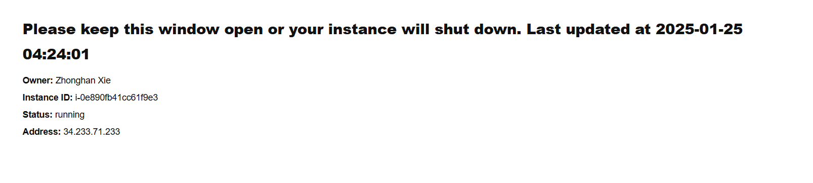
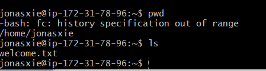

# Homework 1

**SUBJECT**: RE: Welcome to Borromean Digital!  
**FROM:**: [Jonas Zhonghan Xie](jonasxie@umich.edu)  
**TO:**: Jack Whitney  

Hi Jack,

Thank you for your email! I am also delighted to be working with you and the team at Borromean Digital. For the background check process, please let me know if there is any additional information needed from my end.

For Raj's questions:
1. What port does MySQL run on by default?

    MySQL runs on port 3306 by default.

2. I am confused, is SSH a protocol or a port? What would I use SSH to do?

    SSH, full name is Secure Shell, is a **protocol**. It is a cryptographic network protocol which allows us to securely communicate over an unsecured network. It runs on port 22 by default. We mainly use SSH to securely connect to a remote server.

3. What port does SMTP run on by default?

    SMTP runs on port 25 by default.

4. When I try to send my friends emails, I keep getting a response code of 452, what does this mean?

    The response code 452 means that the server has reached the maximum storage capacity. Probably you were trying to send too many emails at once. You can try to send less emails later.

Please let me know if you Raj has any more questions. I am happy to help.

For the server setup, I am able to connect to the server. The screenshot is attached below. The IP address is `34.233.71.233`. As I am connecting to the server with SSH, I am running on port 22.

I am in the directory `/home/jonasxie`. I used command `pwd` to check this. In the directory, there is only a file named `welcome.txt`. I used command `ls` to list the files and folders in the directory. 

Thank you again for the warm welcome! Looking forward to working with you and the team.

Best,
Zhonghan

