# Homework 2

**TO**: D Webster Esq.  
**FROM**: Jonas Zhonghan Xie (SA Team)  
**SUBJECT**: RE: Please Confirm Received Files  

Hi D Webster,

Thank you for reaching out. I am able to access the files. The answers to your questions regarding the files are as follows:

1. There are no directories or files that start with the lowercase "z" in the `world` directory.
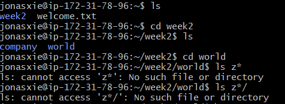

2. We can use `ls -R` to recursively list all the files both in directory and subdirectories. Here I just attached part of the terminal output in the screenshot below.
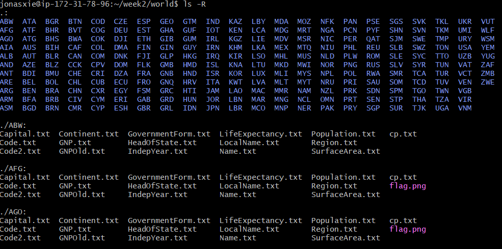

3. We can use `ls -l` to list the details of each file in the directory, including the file size. The size of each file is displayed in the fifth column. The sizes are all in bytes. For example, the size of file `Capital.txt` is 4 bytes. Here I attached the screenshot below.
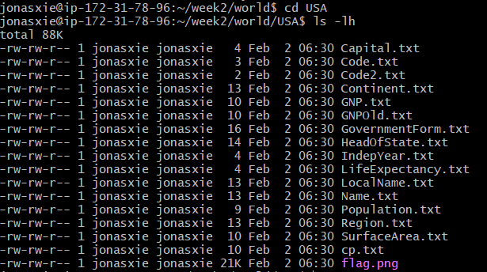

4. In the `ZWE` directory, all the `.txt` files can be viewed using `less` as they are all text files. The graph file `flag.png` cannot be viewed using `less` as it is an image file. `less` cannot render image files. 
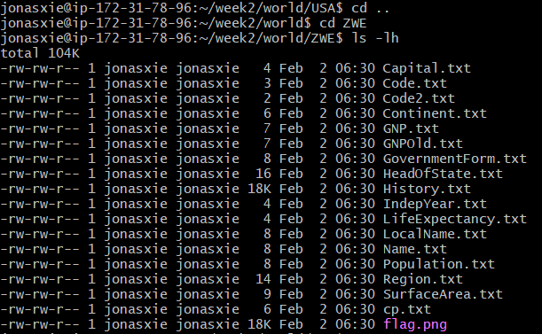

5. We use `-h` setting to display the file size in human-readable format. So we use `ls -lh` to list the files in the `IND` directory. The size of the files ranges from 2 bytes to 18KB. Here I attached the screenshot below. 
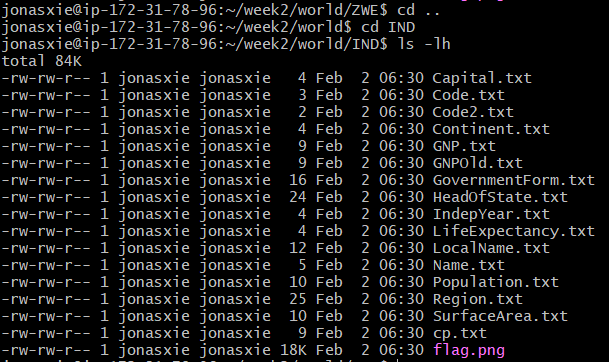

6. Bluma Comellas employee has the ID number of 99944. The detailed information of the employee is listed in the attached screenshot below.
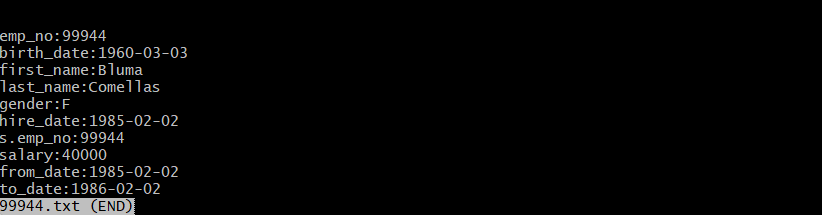
I follow these steps to find the employee:
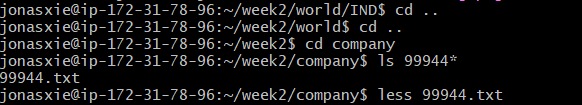

7. The sizes of the files which start with the number 9 are listed in the attached screenshot below. The sizes of the files are all about 170-175 bytes.
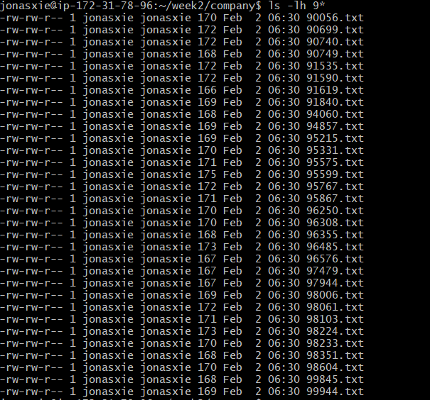

8. The class instructor Prof. Michael Hess also has the access to the server. His unique name `mlhess` can be found in the list of the user.
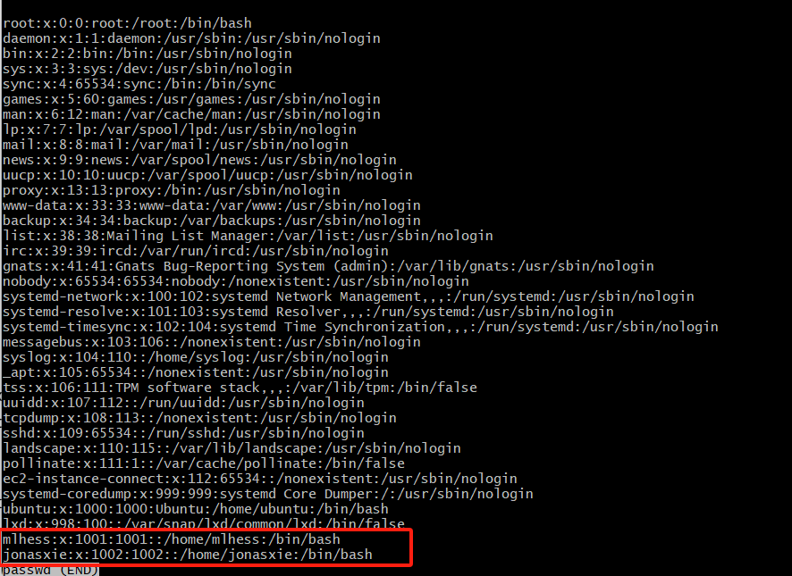
Considering about the sensitive data on the server, it might be better the double check his clearance for the data.  
I followed these steps to find the users:
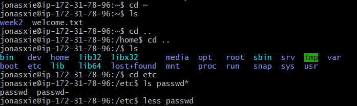

9. Press `ESC` and the space bar in the `less` command to scroll down one page at a time. It will not stop at the end of the file. You can find it in the `less` help file using `less --help`. Here I attached part of the help file below.
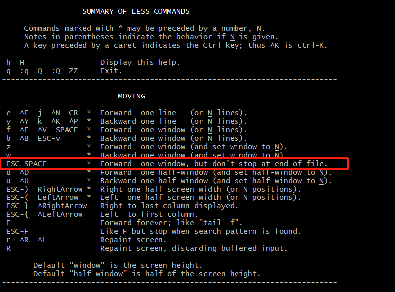

Please let me know if you have further questions about access the data. Thank you so much!

Best,  
Jonas