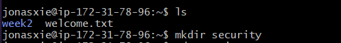

# Homework 3

**SUBJECT**: RE: Security Questions  
**FROM**: Jonas Zhonghan Xie (SA Team)  
**TO**: Kim Min-Jae  

Hi Kim,

THank you for your email. I am happy to work with you and answer your questions.

**Part 1**:  

1. I used `mkdir security` to create the new directory in my home directory.

2. To create the text file, I got into the new directory I just created and used `touch name.txt` to create the txt file.

3. To edit the file, I used `nano name.txt` to open the file and add the text. This is what the nano editor looks like.

4. 5. I followed the same procedures to create a another text file `id.txt` and add the text. This is what the `id.txt` file looks like.

6. This is what `name.txt` and `id.txt` look like in the `security` directory.

**Part 2**:

7. I followed your instructions and downloaded the puzzles directories.

8. I navigated to the `puzzles/puzzle1` directory. I used `nano` to inspect every parts of the story. And I found the right order of the story should be: d-g-b-a-c-e-f. 
  
Then I used `mv` commands to rename the files in the chronological order.

9. I navigated to `puzzle2` directory and used `cat` to read every files. I found the time when each story happened. Then I used `mv` command to rename those files.

10. I used `ls -nR` to list all the files in the `security` directory recursively. Here is the screenshot of the terminal output.

11. I used `nano` to edit each file. The output of the files are as follows:

**Part 3**:
12. I used `cp -r` to make a backup of `puzzles` directory.

13. To delete the `puzzles` directory, I first deleted all the files in the subdirectories. Then I used `rmdir` to delete the empty directories.

14. To move all the subdirectories and files in the backup folder to `security/`, I used `mv security_backup/* ./` command. Then I deleted the backup folder.

15. This is all the files I worked on this week in the `security` directory.

16. My Github username is `NakaFrozn`. 

Let me know if you have any additional questions. Thank you!

Best,
Jonas