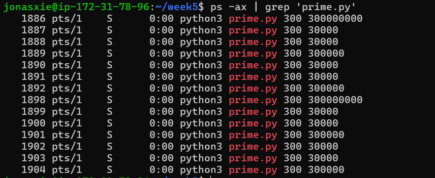

# Homework 5

**FROM:** Jonas Zhonghan Xie  
**TO:** Raj  
**SUBJECT:** RE: Thank you and a few more questions

Hi Raj,

Hope my responses are helpful to you. I am happy to help with your follow up questions.

**Part 1**

1. The first column shows the tasks PIDs running `prime.py`

2. The system load is shown below. The system load in the recent 1 min is 0.02, in the recent 5 mins is 0.52, and in the recent 15 mins is 0.37. As we have 1 processor, the system load is less than 1, which means the system is not overloaded.

3. It seems none of them stopped.

4. I used `grep` to locate the python processes and then used `awk` to locate the processIDs, finally used `xargs kill` to kill the processes.
I used `grep 'pts/1'` to locate only the python3 processes.

**Part 2**

1&2. I used `wget` and `unzip` to download and unzip the NYC inspection file.

3. I used `wc` to count the number of lines, words and characters in the file. There are 399,919 lines, more than 1.3M words and more than 14.6M characters in the file.

4. I used `grep` to filter out the column row in the csv file. Then I used `awk` to locate the fifth column. I used `sort` and `uniq` to filter the unique streets in the column. And finally saved it to the txt file.

5. The first (5) lines of the files are shown below.

**Part 3**

1. I used `curl -s` to fetch the file without showing the transfer status. I used `grep '#||'` to filter out the first row. Then I used `awk` to locate the column of "Type 1" and `sort` and `uniq` to identify the unique values. Finally I saved it to the `unique_type1.txt` file.

2. Using the similar command as 3.1, I used `sort -n` to sort the values in the attack column.

3. I used "||True" to identify the legendary pokemon. The command is shown below and the top 5 lines are shown below.
 

4. I used `awk` to locate the column of HP and then used `sort -n` to sort the values in the HP column. Then I used `grep` to filter the row of 45 and then passed it to `wc` to count the lines. There are 38 pokemons with HP of 45. Then I saved the result to `hp_45_count.txt`

5. The first 7 lines of the txt files are shown below.

**Part 4**

1. I created the zip file `week5.tar.gz`. It is about 43M in size.
 

Let me know if you have any follow up questions.

Best,  
Jonas